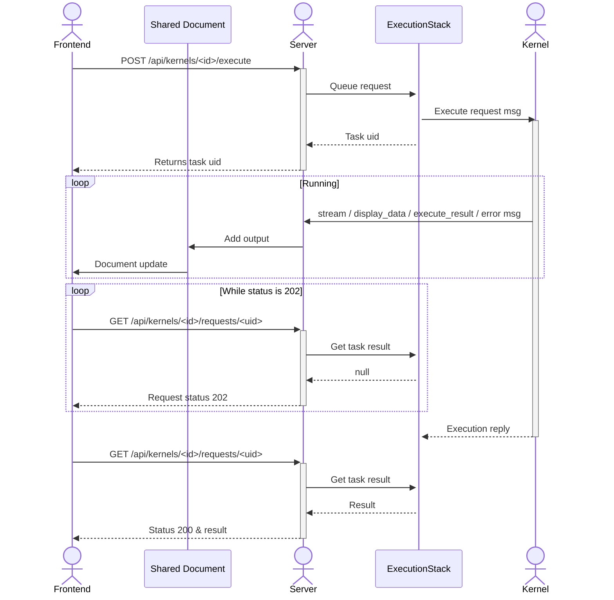
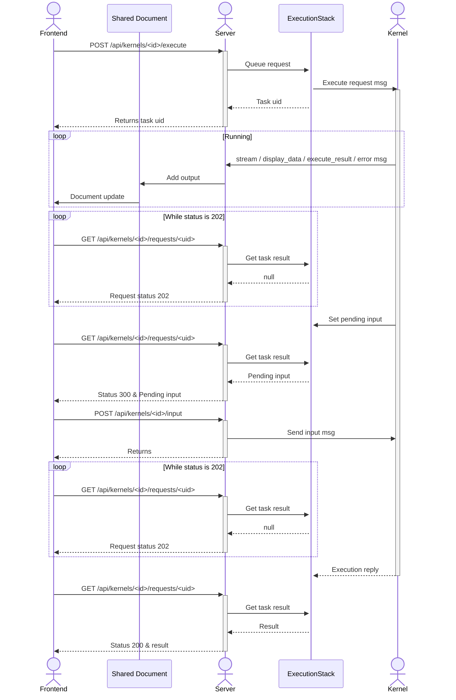

[](https://datalayer.io)

[](https://github.com/sponsors/datalayer)

# 🪐 Jupyter Server NbModel

[](https://github.com/datalayer/jupyter-server-nbmodel/actions/workflows/build.yml)
[](https://mybinder.org/v2/gh/datalayer/jupyter-server-nbmodel/main?urlpath=lab)

> Stop session timeouts and lost.

A Jupyter Server extension to execute code from the server-side NbModel.

<p align="center">
  
  <br>
  <em>Side-by-side comparison: Without jupyter_server_nbmodel (left), notebook execution stops when reloading the page; with jupyter_server_nbmodel (right), execution continues uninterrupted even after reload.</em>
</p>

This extension is composed of a Python package named `jupyter_server_nbmodel`
for the server extension and a NPM package named `@datalayer/jupyter-server-nbmodel`
for the frontend extension.

## Requirements

- Jupyter Server
- \[RECOMMENDED\] Real-time collaboration for JupyterLab/Notebook:
  This will push the kernels results in the notebook from the server.

## Install

To install the extension for use in JupyterLab or Notebook 7, execute:

```bash
pip install "jupyter_server_nbmodel[lab]"
```

For API-only use:

```bash
pip install jupyter_server_nbmodel
```

## Uninstall

To remove the extension, execute:

```bash
pip uninstall jupyter_server_nbmodel
```

## Troubleshoot

If you are seeing the frontend extension, but it is not working, check
that the server extension is enabled:

```bash
jupyter server extension list
```

If the server extension is installed and enabled, but you are not seeing
the frontend extension, check the frontend extension is installed:

```bash
jupyter labextension list
```

## How does it works

### Generic case

Execution of a Python code snippet: `print("hello")`



### With input case

Execution of a Python code snippet: `input("Age:")`



> \[!NOTE\]
> The code snippet is always send in the body of the POST `/api/kernels/<id>/execute`
> request to avoid document model discrepancy; the document on the backend is only
> eventually identical with the frontends (document updates are not instantaneous).
>
> The `ExecutionStack` maintains an execution queue per kernels to ensure execution
> order.

## Contributing

### Development install

Note: You will need NodeJS to build the extension package.

The `jlpm` command is JupyterLab's pinned version of
[yarn](https://yarnpkg.com/) that is installed with JupyterLab. You may use
`yarn` or `npm` in lieu of `jlpm` below.

```bash
# Clone the repo to your local environment
# Change directory to the jupyter_server_nbmodel directory
# Install package in development mode
pip install -e ".[test]"
# Link your development version of the extension with JupyterLab
jupyter labextension develop . --overwrite
# Server extension must be manually installed in develop mode
jupyter server extension enable jupyter_server_nbmodel
# Rebuild extension Typescript source after making changes
jlpm build
```

You can watch the source directory and run JupyterLab at the same time in different terminals to watch for changes in the extension's source and automatically rebuild the extension.

```bash
# Watch the source directory in one terminal, automatically rebuilding when needed
jlpm watch
# Run JupyterLab in another terminal
jupyter lab --autoreload
```

With the watch command running, every saved change will immediately be built locally and available in your running JupyterLab. Refresh JupyterLab to load the change in your browser (you may need to wait several seconds for the extension to be rebuilt).

By default, the `jlpm build` command generates the source maps for this extension to make it easier to debug using the browser dev tools. To also generate source maps for the JupyterLab core extensions, you can run the following command:

```bash
jupyter lab build --minimize=False
```

### Development uninstall

```bash
# Server extension must be manually disabled in develop mode
jupyter server extension disable jupyter_server_nbmodel
pip uninstall jupyter_server_nbmodel
```

In development mode, you will also need to remove the symlink created by `jupyter labextension develop`
command. To find its location, you can run `jupyter labextension list` to figure out where the `labextensions`
folder is located. Then you can remove the symlink named `jupyter-server-nbmodel` within that folder.

### Testing the extension

#### Server tests

This extension is using [Pytest](https://docs.pytest.org/) for Python code testing.

Install test dependencies (needed only once):

```sh
pip install -e ".[test]"
# Each time you install the Python package, you need to restore the front-end extension link
jupyter labextension develop . --overwrite
```

To execute them, run:

```sh
pytest -vv -r ap --cov jupyter_server_nbmodel
```

#### Frontend tests

This extension is using [Jest](https://jestjs.io/) for JavaScript code testing.

To execute them, execute:

```sh
jlpm
jlpm test
```

#### Integration tests

This extension uses [Playwright](https://playwright.dev/docs/intro) for the integration tests (aka user level tests).
More precisely, the JupyterLab helper [Galata](https://github.com/jupyterlab/jupyterlab/tree/master/galata) is used to handle testing the extension in JupyterLab.

More information are provided within the [ui-tests](./ui-tests/README.md) README.

### Manual testing

```bash
# Terminal 1.
# You can also invoke `make jupyter-server`
jupyter server --port 8888 --autoreload --ServerApp.disable_check_xsrf=True --IdentityProvider.token= --ServerApp.port_retries=0
```

```bash
# Terminal 2.
KERNEL=$(curl -X POST http://localhost:8888/api/kernels)
echo $KERNEL

KERNEL_ID=$(echo $KERNEL | jq --raw-output '.id')
echo $KERNEL_ID

RESPONSE=$(curl --include http://localhost:8888/api/kernels/$KERNEL_ID/execute -d "{ \"code\": \"print('1+1')\" }")
echo $RESPONSE

RESULT_PATH=$(echo $RESPONSE | grep -oP 'Location:\s*\K[^ ]+' | tr -d '\r\n')
echo $RESULT_PATH

URL="http://localhost:8888${RESULT_PATH}"
echo $URL

curl "$URL"
# {"status": "ok", "execution_count": 1, "outputs": "[{\"output_type\": \"stream\", \"name\": \"stdout\", \"text\": \"1+1\\n\"}]"}
```

### Running Tests

Install dependencies:

```bash
pip install -e ".[test]"
```

To run the python tests, use:

```bash
pytest

# To test a specific file
pytest jupyter_server_nbmodel/tests/test_handlers.py

# To run a specific test
pytest jupyter_server_nbmodel/tests/test_handlers.py -k "test_post_execute"
```

### Development uninstall

```bash
pip uninstall jupyter_server_nbmodel
```

### Packaging the extension

See [RELEASE](RELEASE.md)
