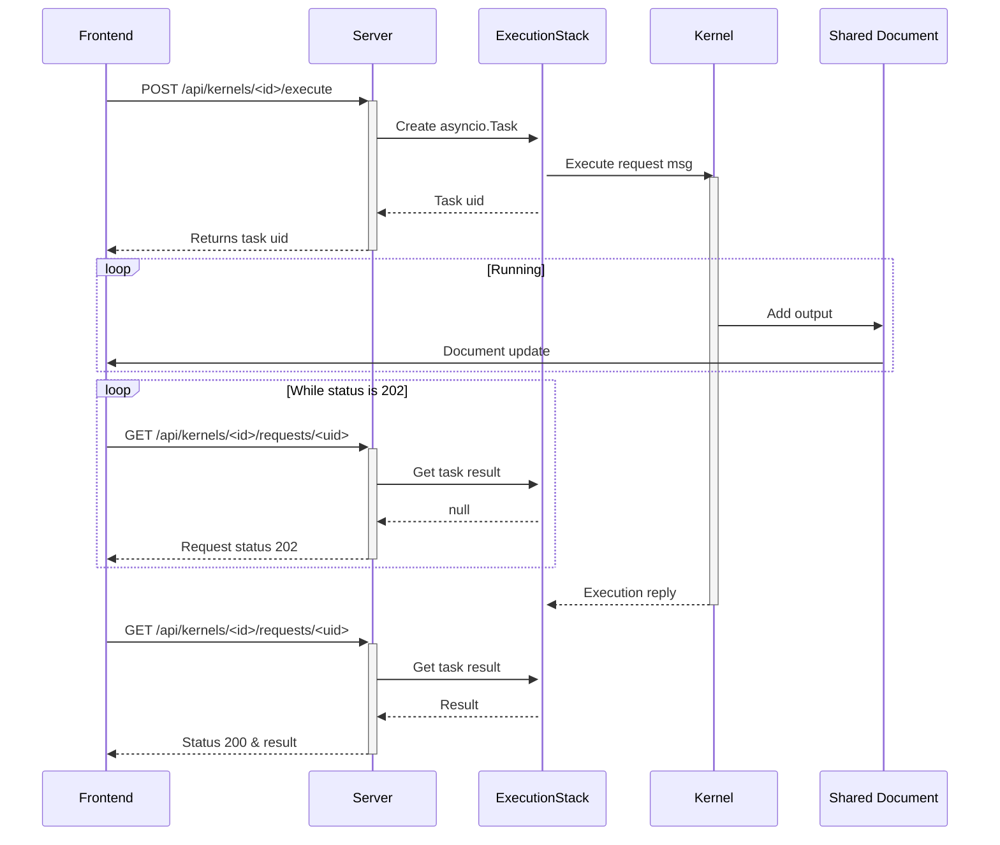
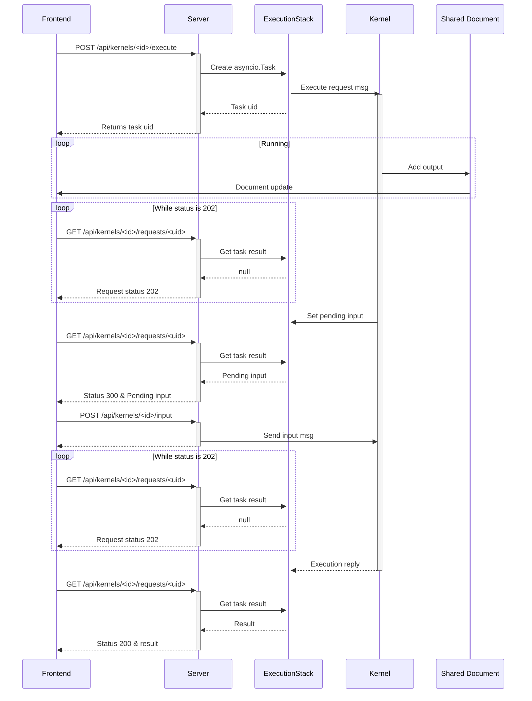

# jupyter_server_nbmodel

[](https://github.com/datalayer/jupyter-server-nbmodel/actions/workflows/build.yml)
[](https://mybinder.org/v2/gh/datalayer/jupyter-server-nbmodel/main)

A Jupyter Server extension to execute code cell from the server.

## Requirements

- Jupyter Server

## Install

To install the extension, execute:

```bash
pip install jupyter_server_nbmodel
```

## Uninstall

To remove the extension, execute:

```bash
pip uninstall jupyter_server_nbmodel
```

## Troubleshoot

If you are seeing the frontend extension, but it is not working, check
that the server extension is enabled:

```bash
jupyter server extension list
```

## How does it works

### Generic case

Execution of a Python code snippet: `print("hello")`



### With input case


Execution of a Python code snippet: `input("Age:")`



## Contributing

### Development install

```bash
# Clone the repo to your local environment
# Change directory to the jupyter_server_nbmodel directory
# Install package in development mode - will automatically enable
# The server extension.
pip install -e .
```

You can watch the source directory and run your Jupyter Server-based application at the same time in different terminals to watch for changes in the extension's source and automatically rebuild the extension.  For example,
when running JupyterLab:

```bash
jupyter lab --autoreload
```

If your extension does not depend a particular frontend, you can run the
server directly:

```bash
jupyter server --autoreload
```

### Manual testing

```bash
# Terminal 1.
jupyter server --port 8888 --autoreload --ServerApp.disable_check_xsrf=True --IdentityProvider.token= --ServerApp.port_retries=0

# Terminal 2.
KERNEL=$(curl -X POST http://localhost:8888/api/kernels)
echo $KERNEL
KERNEL_ID=$(echo $KERNEL | jq --raw-output '.id')
echo $KERNEL_ID
REQUEST=$(curl --include http://localhost:8888/api/kernels/$KERNEL_ID/execute -d "{ \"code\": \"print('1+1')\" }")
RESULT=$(echo $REQUEST | grep -i ^Location: | cut -d' ' -f2 | tr -d '\r')
echo $RESULT

curl http://localhost:8888$RESULT
{"status": "ok", "execution_count": 1, "outputs": "[{\"output_type\": \"stream\", \"name\": \"stdout\", \"text\": \"1+1\\n\"}]"}
```

### Running Tests

Install dependencies:

```bash
pip install -e ".[test]"
```

To run the python tests, use:

```bash
pytest

# To test a specific file
pytest jupyter_server_nbmodel/tests/test_handlers.py

# To run a specific test
pytest jupyter_server_nbmodel/tests/test_handlers.py -k "test_post_execute"
```

### Development uninstall

```bash
pip uninstall jupyter_server_nbmodel
```

### Packaging the extension

See [RELEASE](RELEASE.md)
