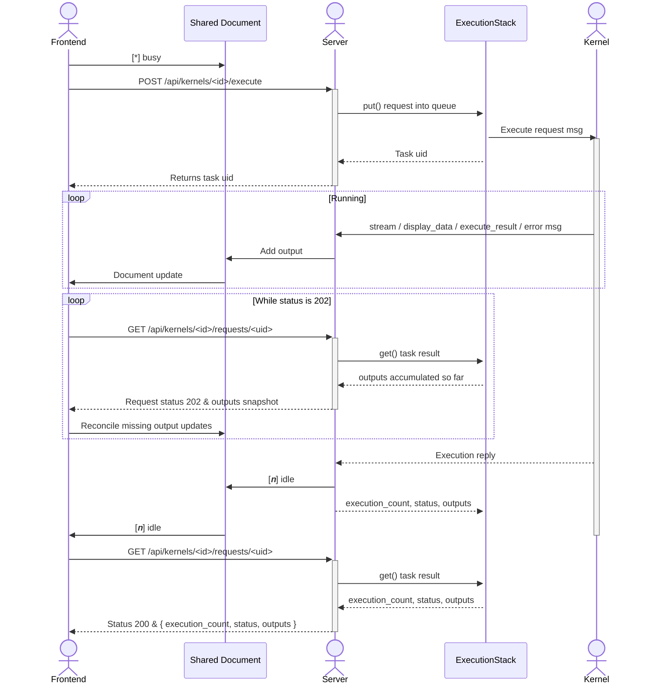
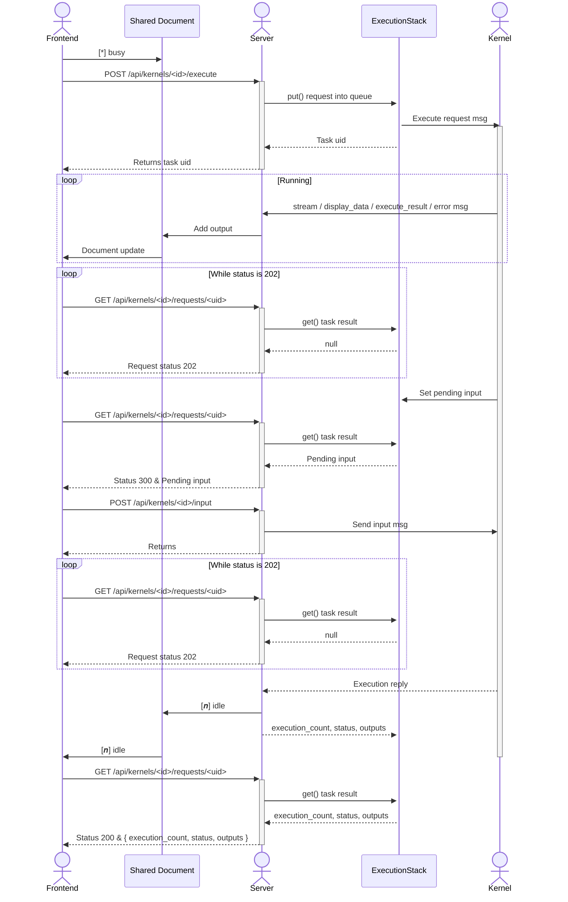

[](https://datalayer.io)

[](https://github.com/sponsors/datalayer)

# 🪐 Jupyter Server NbModel

[](https://github.com/datalayer/jupyter-server-nbmodel/actions/workflows/build.yml)

> Stop losing your outputs due to session timeouts or network loss.

A Jupyter Server extension to execute code from the server-side NbModel to keep your sessions and outputs active.

<p align="center">
  
  <br>
  <em>Side-by-side comparison: Without jupyter_server_nbmodel (left), notebook execution stops when reloading the page; with jupyter_server_nbmodel (right), execution continues uninterrupted even after reload.</em>
</p>

This extension is composed of a Python package named `jupyter_server_nbmodel`
for the server extension and a NPM package named `@datalayer/jupyter-server-nbmodel`
for the frontend extension. After installing the extension, run the snippet below in JupyterLab to try it.

```py
import time

for i in range(1, 1000):
    print(i)
    time.sleep(1)
```

## Requirements

- Jupyter Server `>=2.0.1,<3`.
- JupyterLab or Jupyter Notebook 7.
- Optional but recommended for full live output sync in the document UI:
    real-time collaboration in JupyterLab/Notebook.

## Install

To install the extension for use in JupyterLab or Notebook 7, execute:

```bash
pip install "jupyter_server_nbmodel[lab]"
```

For API-only use:

```bash
pip install jupyter_server_nbmodel
```

## Uninstall

To remove the extension, execute:

```bash
pip uninstall jupyter_server_nbmodel
```

## Troubleshoot

If you are seeing the frontend extension, but it is not working, check
that the server extension is enabled:

```bash
jupyter server extension list
```

If the server extension is installed and enabled, but you are not seeing
the frontend extension, check the frontend extension is installed:

```bash
jupyter labextension list
```

### Existing notebooks stop receiving live outputs

This issue was initially difficult to distinguish from a kernel message-routing
problem. On the same server and kernel, a newly created notebook could stream
normally while an existing notebook executed without displaying anything. A
server restart alone did not consistently cause or resolve the problem, so the
important difference was the notebook's persisted collaborative history rather
than the lifetime of the kernel or server process.

The debugging sessions produced the following evidence:

- The server received the kernel IOPub messages and its output hook processed
  them. After execution, the expected stream output was present in the
  persisted `.ipynb` file. This ruled out a missing kernel message, an incorrect
  kernel client ID, and a future rejecting messages from another parent ID.
- Affected browser models emitted no shared-cell change events—not even the
  prompt updates normally observed during execution—although execution
  continued on the server.
- Resolving the active YDoc by notebook path, instead of relying on a possibly
  stale room ID retained across a restart, fixed one failure mode but did not
  fix notebooks carrying the problematic history.
- Removing `jupyter_server_nbmodel` restored JupyterLab's standard
  kernel-future execution and displayed outputs. Disabling collaboration alone
  did not restore the server-side execution path, confirming that the failure
  was in the document/output synchronization used by this extension rather
  than in the kernel itself.
- Backing up and removing `.jupyter_ystore.db` restored output updates for the
  same notebooks. This was the strongest indication that the failure followed
  persisted YStore state rather than notebook source, kernel state, or a server
  restart.
- In the failing state, the browser's Yjs document retained incoming updates in
  `Y.Doc.store.pendingStructs`. Those updates referenced CRDT dependencies that
  the browser could not resolve, so they never became observable shared-model
  changes even though the server could persist the resulting notebook.

There were ultimately three related but distinct failures:

1. Some historical YStore documents contained an unresolved CRDT dependency
   chain. The browser retained later updates in `Y.Doc.store.pendingStructs`,
   so the server could save the output while the browser never observed it.
   The operation that originally created every affected historical chain has
   not been isolated.
2. The HTTP recovery made the browser and server concurrent writers to the
   cell's shared output array. If the browser inserted the accumulated stream
   `1234` and the server then blindly appended its view of the same stream, the
   persisted result could become `12341234`. The server now compares the
   current shared text with its kernel-side accumulator and treats an already
   applied snapshot as a no-op.
3. An attempted fix used an array-wide authoritative synchronizer that deleted
   and replaced integrated output entries. A nested `Map`/`Text` replacement
   could temporarily expose `{output_type: "stream"}` without `text` to the
   JavaScript model. JupyterLab then failed in `OutputAreaModel._add` while
   calling `value.text.join("")`; code-cell construction aborted and the
   notebook appeared completely empty. That synchronizer was removed. The
   current hook never replaces or deletes integrated output-array entries.

#### Concrete `pycrdt` checks used during debugging

The following command reproduces the supported stream representation and the
append operation used by the server. The nested `Text` is first placed in a
shared `Map`, the `Map` is integrated into a shared `Array`, and `Text.__iadd__`
owns its transaction. It is intentionally not wrapped in
`with outputs.doc.transaction()`.

```bash
python - <<'PY'
from pycrdt import Array, Doc, Map, Text

server = Doc()
server_outputs = server.get("outputs", type=Array)
with server.transaction():
    server_outputs.append(
        Map({
            "output_type": "stream",
            "name": "stdout",
            "text": Text("1\n"),
        })
    )

browser = Doc()
browser_outputs = browser.get("outputs", type=Array)
browser.apply_update(server.get_update())
server_state = server.get_state()

text = browser_outputs[0]["text"]
assert isinstance(text, Text)
text += "2\n"
server.apply_update(browser.get_update(server_state))

print(repr(str(browser_outputs[0]["text"])))
print(repr(str(server_outputs[0]["text"])))
PY
```

The observed result was:

```text
'1\n2\n'
'1\n2\n'
```

We also reconstructed the real SQLite YStore during the investigation instead
of assuming that the `.ipynb` file described the browser's CRDT state. The
important detail is to create typed roots before applying updates:

```bash
python - <<'PY'
import sqlite3
from pycrdt import Array, Doc, Map

database = "/home/echarles/Desktop/notebooks/.jupyter_ystore.db"
connection = sqlite3.connect(f"file:{database}?mode=ro", uri=True)

for (room,) in connection.execute("SELECT DISTINCT path FROM yupdates"):
    document = Doc()
    cells = document.get("cells", type=Array)
    metadata = document.get("meta", type=Map)
    state = document.get("state", type=Map)

    updates = connection.execute(
        "SELECT yupdate FROM yupdates WHERE path = ? ORDER BY timestamp",
        (room,),
    )
    for (update,) in updates:
        document.apply_update(update)

    print(room, state.to_py().get("path"), len(cells))
    for index, cell in enumerate(cells):
        outputs = cell.get("outputs", [])
        print(index, [output.to_py() for output in outputs])
PY
```

This confirmed that the inspected `.ipynb` files still contained their cells
and that the final reconstructed YStore values had valid stream text. The
empty-notebook crash came from an invalid transient nested update delivered to
the live JavaScript model, not from cells being deleted from the notebook file.
Stopping the server and resetting an already-polluted YStore may still be
required; correcting the writer prevents creating that state again but cannot
remove historical updates already stored in the database.

To remain functional with an affected history, execution now uses a primary
output path plus two recovery layers:

1. Collaborative YDoc updates remain the primary, immediate streaming path.
2. Every pending `GET /api/kernels/<id>/requests/<uid>` response also contains
   the outputs accumulated by the server so far. The frontend normalizes
   consecutive stream chunks and compares the snapshot with the current shared
   cell. Older or initially empty snapshots are ignored, while a newer stream
   snapshot appends only its missing text suffix through JupyterLab's output
   model. It does not replace and recreate the complete rendered output on
   every poll. Polling backs off to a maximum interval of one second.
3. The final `200` response reconciles outputs, execution count, and idle state
   once more. This explains why an earlier version of the recovery displayed
   output only when execution completed: it only implemented this final step,
   not the pending snapshots.

The existing execution endpoints also return the request ID, kernel ID, cell
ID, notebook path, and request state (`queued`, `running`, `input`, or
`complete`). While an execution is active, its request ID and URL are stored in
the code cell metadata under `jupyter_server_nbmodel`. After a page refresh, a
separate restoration plugin reads that metadata and resumes the same
`GET /api/kernels/<id>/requests/<uid>` poller; no additional discovery endpoint
is needed. The resumed request also restores the stock JupyterLab kernel
connection to `busy` until the final response changes it to `idle`. A kernel
connection created after a refresh intentionally starts as `unknown` and
cannot replay the `busy` IOPub message emitted before it existed, so the
frontend feeds the richer REST request state through JupyterLab's normal
kernel-status update path. This works without the Datalayer UI extension.
If transient cell metadata has not reached the refreshed browser yet, the
frontend queries the existing `GET /api/kernels/<id>/execute` route for active
requests and restores the matching cell poller from the returned request ID,
URL, notebook path, and cell ID.

Polling reconciliation and the server output hook are both writers to the
shared document. Before appending a stream chunk, the server therefore compares
the current shared text with its accumulated kernel output. If the browser has
already inserted `1234` from a pending response, integrating the corresponding
server update is a no-op rather than appending the same snapshot and persisting
`12341234`. This check does not replace or delete integrated output-array
entries, because restructuring nested Yjs values can expose a transient stream
without a `text` field while JupyterLab is constructing the cell widget.

Useful browser diagnostics are:

- `[jupyter-server-nbmodel] Received shared cell update` indicates that normal
  collaborative updates are reaching the cell.
- `[jupyter-server-nbmodel] Applying pending output snapshot` indicates that
  the polling fallback found outputs missing from the browser model.
- `[jupyter-server-nbmodel] Execution completed` reports the number of shared
  updates and whether final output or execution-count reconciliation was
  needed.

The Network panel can also be used to inspect the pending `202` responses. Once
the kernel has emitted output, their JSON bodies should contain a serialized
`outputs` snapshot. If the server response and persisted `.ipynb` contain the
output while the browser reports no shared updates, the problem is in document
synchronization rather than kernel execution.

Removing `.jupyter_ystore.db` resets the stored collaborative history, but it
also discards that history for every document recorded in the database. Its
location depends on the Jupyter Server configuration and content root. Stop the
server and make a backup before using this as a last-resort recovery action.

## How does it works

### Generic case

Execution of a Python code snippet: `print("hello")`


```mermaid
sequenceDiagram
    actor Frontend; participant Shared Document; actor Server; participant ExecutionStack; actor Kernel
    Frontend->>Shared Document: [*] busy
    Frontend->>+Server: POST /api/kernels/<id>/execute
    Server->>+ExecutionStack: put() request into queue
    ExecutionStack->>Kernel: Execute request msg
    activate Kernel
    ExecutionStack-->>Server: Task uid
    Server-->>-Frontend: Returns task uid
    loop Running
        Kernel->>Server: stream / display_data / execute_result / error msg
        Server->>Shared Document: Add output
        Shared Document->>Frontend: Document update
    end
    loop While status is 202
        Frontend->>+Server: GET /api/kernels/<id>/requests/<uid>
        Server->>ExecutionStack: get() task result
        ExecutionStack-->>Server: outputs accumulated so far
        Server-->>-Frontend: Request status 202 & outputs snapshot
        Frontend->>Shared Document: Reconcile missing output updates
    end
    Kernel-->>Server: Execution reply
    Server->>Shared Document: [𝒏] idle
    Server-->>ExecutionStack: execution_count, status, outputs
    Shared Document->>Frontend: [𝒏] idle
    deactivate Kernel
    Frontend->>+Server: GET /api/kernels/<id>/requests/<uid>
    Server->>ExecutionStack: get() task result
    ExecutionStack-->>Server: execution_count, status, outputs
    Server-->>-Frontend: Status 200 & { execution_count, status, outputs }
```

### With input case

Execution of a Python code snippet: `input("Age:")`


```mermaid
sequenceDiagram
    actor Frontend; participant Shared Document; actor Server; participant ExecutionStack; actor Kernel
    Frontend->>Shared Document: [*] busy
    Frontend->>+Server: POST /api/kernels/<id>/execute
    Server->>+ExecutionStack: put() request into queue
    ExecutionStack->>Kernel: Execute request msg
    activate Kernel
    ExecutionStack-->>Server: Task uid
    Server-->>-Frontend: Returns task uid
    loop Running
        Kernel->>Server: stream / display_data / execute_result / error msg
        Server->>Shared Document: Add output
        Shared Document->>Frontend: Document update
    end
    loop While status is 202
        Frontend->>+Server: GET /api/kernels/<id>/requests/<uid>
        Server->>ExecutionStack: get() task result
        ExecutionStack-->>Server: null
        Server-->>-Frontend: Request status 202
    end
    Kernel->>ExecutionStack: Set pending input
    Frontend->>+Server: GET /api/kernels/<id>/requests/<uid>
    Server->>ExecutionStack: get() task result
    ExecutionStack-->>Server: Pending input
    Server-->>-Frontend: Status 300 & Pending input
    Frontend->>+Server: POST /api/kernels/<id>/input
    Server->>Kernel: Send input msg
    Server-->>-Frontend: Returns
    loop While status is 202
        Frontend->>+Server: GET /api/kernels/<id>/requests/<uid>
        Server->>ExecutionStack: get() task result
        ExecutionStack-->>Server: null
        Server-->>-Frontend: Request status 202
    end
    Kernel-->>Server: Execution reply
    Server->>Shared Document: [𝒏] idle
    Server-->>ExecutionStack: execution_count, status, outputs
    Shared Document->>Frontend: [𝒏] idle
    deactivate Kernel
    Frontend->>+Server: GET /api/kernels/<id>/requests/<uid>
    Server->>ExecutionStack: get() task result
    ExecutionStack-->>Server: execution_count, status, outputs
    Server-->>-Frontend: Status 200 & { execution_count, status, outputs }
```

> \[!NOTE\]
> The code snippet is always send in the body of the POST `/api/kernels/<id>/execute`
> request to avoid document model discrepancy; the document on the backend is only
> eventually identical with the frontends (document updates are not instantaneous).
>
> The `ExecutionStack` maintains an execution queue per kernels to ensure execution
> order.

## Contributing

### Development install

Note: You will need NodeJS to build the extension package.

The `jlpm` command is JupyterLab's pinned version of
[yarn](https://yarnpkg.com/) that is installed with JupyterLab. You may use
`yarn` or `npm` in lieu of `jlpm` below.

```bash
# Clone the repo to your local environment
# Change directory to the jupyter_server_nbmodel directory
# Install package in development mode
pip install -e ".[test]"
# Link your development version of the extension with JupyterLab
jupyter labextension develop . --overwrite
# Server extension must be manually installed in develop mode
jupyter server extension enable jupyter_server_nbmodel
# Rebuild extension Typescript source after making changes
jlpm build
```

You can watch the source directory and run JupyterLab at the same time in different terminals to watch for changes in the extension's source and automatically rebuild the extension.

```bash
# Watch the source directory in one terminal, automatically rebuilding when needed
jlpm watch
# Run JupyterLab in another terminal
jupyter lab --autoreload
```

With the watch command running, every saved change will immediately be built locally and available in your running JupyterLab. Refresh JupyterLab to load the change in your browser (you may need to wait several seconds for the extension to be rebuilt).

By default, the `jlpm build` command generates the source maps for this extension to make it easier to debug using the browser dev tools. To also generate source maps for the JupyterLab core extensions, you can run the following command:

```bash
jupyter lab build --minimize=False
```

### Development uninstall

```bash
# Server extension must be manually disabled in develop mode
jupyter server extension disable jupyter_server_nbmodel
pip uninstall jupyter_server_nbmodel
```

In development mode, you will also need to remove the symlink created by `jupyter labextension develop`
command. To find its location, you can run `jupyter labextension list` to figure out where the `labextensions`
folder is located. Then you can remove the symlink named `jupyter-server-nbmodel` within that folder.

### Testing the extension

#### Server tests

This extension is using [Pytest](https://docs.pytest.org/) for Python code testing.

Install test dependencies (needed only once):

```sh
pip install -e ".[test]"
# Each time you install the Python package, you need to restore the front-end extension link
jupyter labextension develop . --overwrite
```

To execute them, run:

```sh
pytest
```

#### Frontend tests

This extension is using [Jest](https://jestjs.io/) for JavaScript code testing.

To execute them, execute:

```sh
jlpm
jlpm test
```

#### Integration tests

This extension uses [Playwright](https://playwright.dev/docs/intro) for the integration tests (aka user level tests).
More precisely, the JupyterLab helper [Galata](https://github.com/jupyterlab/jupyterlab/tree/master/galata) is used to handle testing the extension in JupyterLab.

More information are provided within the [ui-tests](./ui-tests/README.md) README.

### Manual testing

```bash
# Terminal 1.
# You can also invoke `make jupyter-server`
jupyter server --port 8888 --autoreload --ServerApp.disable_check_xsrf=True --IdentityProvider.token= --ServerApp.port_retries=0
```

```bash
# Terminal 2.
KERNEL=$(curl -X POST http://localhost:8888/api/kernels)
echo $KERNEL

KERNEL_ID=$(echo $KERNEL | jq --raw-output '.id')
echo $KERNEL_ID

RESPONSE=$(curl --include http://localhost:8888/api/kernels/$KERNEL_ID/execute -d "{ \"code\": \"print('1+1')\" }")
echo $RESPONSE

RESULT_PATH=$(echo $RESPONSE | grep -oP 'Location:\s*\K[^ ]+' | tr -d '\r\n')
echo $RESULT_PATH

URL="http://localhost:8888${RESULT_PATH}"
echo $URL

curl "$URL"
# {"status": "ok", "execution_count": 1, "outputs": "[{\"output_type\": \"stream\", \"name\": \"stdout\", \"text\": \"1+1\\n\"}]"}
```

### Running Tests

Install dependencies:

```bash
pip install -e ".[test]"
```

To run the python tests, use:

```bash
pytest

# To test a specific file
pytest jupyter_server_nbmodel/tests/test_handlers.py

# To run a specific test
pytest jupyter_server_nbmodel/tests/test_handlers.py -k "test_post_execute"
```

### Development uninstall

```bash
pip uninstall jupyter_server_nbmodel
```

### Packaging the extension

See [RELEASE](RELEASE.md)
