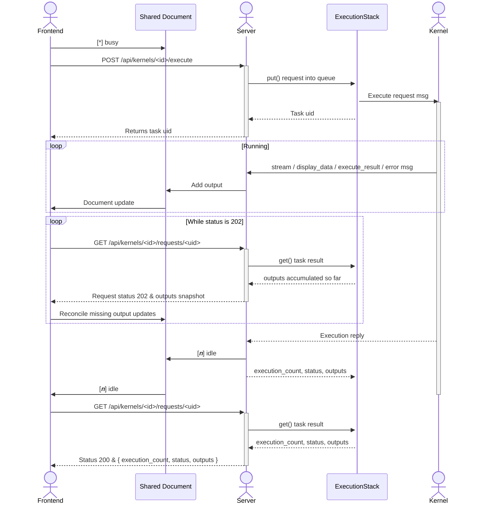
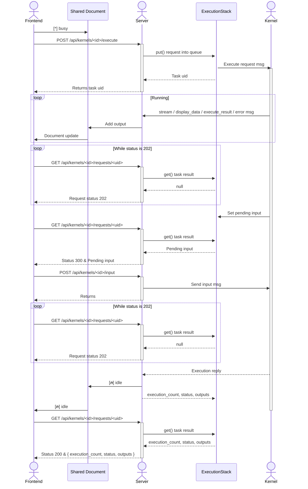

<a href="https://datalayer.ai"></a>

[](https://github.com/sponsors/datalayer)
[](https://github.com/datalayer/jupyter-server-nbmodel/actions/workflows/build.yml)

[](https://pypi.org/project/jupyter-server-nbmodel) [](https://pepy.tech/project/jupyter-server-nbmodel) [](https://opensource.org/licenses/BSD-3-Clause)

# 🪐 📄 Jupyter Server Nbmodel

[](https://datalayer.ai)

**Stop losing your outputs to session timeouts or network loss.**

Your cells run on the server, so a reload, a closed laptop or a dropped connection no longer
costs you an execution — and the outputs are still there when you come back.

📖 [Documentation](https://jupyter-server-nbmodel.datalayer.tech) &nbsp;·&nbsp; 🔀 [Output reconciliation](https://jupyter-server-nbmodel.datalayer.tech/reconciliation) &nbsp;·&nbsp; 💬 [Community](https://jupyter-server-nbmodel.datalayer.tech/community)

- **⚡ Durable execution** — a cell keeps running with no browser connected to it.
- **🖥️ Terminal-faithful outputs** — progress bars overwrite their line, as they should.
- **🤖 Agent ready** — a REST API to run cells and read outputs, so an agent works
  from the same Notebook you do.

[](https://jupyter-mcp-server.datalayer.tech/hosted)

**Your agent can now reach these Notebooks without running anything.** Datalayer hosts a
Jupyter MCP endpoint at **`https://mcp.datalayer.run/mcp`** — durable execution included, so a cell keeps running after the agent disconnects.

→ [**Hosted Jupyter MCP Server**](https://jupyter-mcp-server.datalayer.tech/hosted)

[](https://github.com/datalayer/jupyter-mcp-server/tree/main/ext/claude-plugin)
 
Claude Code connects with one command through
the [Datalayer plugin](https://github.com/datalayer/jupyter-mcp-server/tree/main/ext/claude-plugin).

→ [**Datalayer plugin for Claude Code**](https://github.com/datalayer/jupyter-mcp-server/tree/main/ext/claude-plugin)

---

**Free and open source, BSD 3-Clause** — install it in your own Jupyter, no account needed.
Built and maintained by [**Datalayer**](https://datalayer.ai), where the same durable execution powers always-on Notebooks that humans and AI agents work in together.

[](https://pypi.org/project/jupyter-server-nbmodel) [](https://datalayer.ai)

<p align="center">
  
  <br>
  <em>Side-by-side comparison: Without jupyter_server_nbmodel (left), notebook execution stops when reloading the page; with jupyter_server_nbmodel (right), execution continues uninterrupted even after reload.</em>
</p>

A Jupyter Server extension to execute code from the server-side Nbmodel to keep your sessions and outputs active.

This extension is composed of a Python package named `jupyter_server_nbmodel`
for the server extension and a NPM package named `@datalayer/jupyter-server-nbmodel`
for the frontend extension. After installing the extension, run the snippet below in JupyterLab to try it.

```py
import time

for i in range(1, 1000):
    print(i)
    time.sleep(1)
```

Streaming outputs also work with `tqdm`, whose progress bar overwrites its line
instead of printing one line per update.

```py
from tqdm import tqdm  # Standard tqdm, not tqdm.notebook
import time

for i in tqdm(range(100)):
    time.sleep(0.1)  # Simulate long-running process
```

## Requirements

- Jupyter Server `>=2.0.1,<3`.
- JupyterLab or Jupyter Notebook 7.
- Optional but recommended for full live output sync in the document UI:
    real-time collaboration in JupyterLab/Notebook.

## Install

To install the extension for use in JupyterLab or Notebook 7, execute:

```bash
pip install "jupyter_server_nbmodel[lab]"
```

For API-only use:

```bash
pip install jupyter_server_nbmodel
```

## Uninstall

To remove the extension, execute:

```bash
pip uninstall jupyter_server_nbmodel
```

## Troubleshoot

If you are seeing the frontend extension, but it is not working, check
that the server extension is enabled:

```bash
jupyter server extension list
```

If the server extension is installed and enabled, but you are not seeing
the frontend extension, check the frontend extension is installed:

```bash
jupyter labextension list
```

### Existing notebooks stop receiving live outputs

---


Outputs are saved by the server and never appear in the notebook: the
collaborative history of that document carries updates the browser cannot
integrate.

[**Reconciliation**](https://jupyter-server-nbmodel.datalayer.tech/output-reconciliation) explains what was
found, what writes the outputs in each mode, and the `outputRecovery` setting that works around it.

---

## How does it works

### Generic case

Execution of a Python code snippet: `print("hello")`


```mermaid
sequenceDiagram
    actor Frontend; participant Shared Document; actor Server; participant ExecutionStack; actor Kernel
    Frontend->>Shared Document: [*] busy
    Frontend->>+Server: POST /api/kernels/<id>/execute
    Server->>+ExecutionStack: put() request into queue
    ExecutionStack->>Kernel: Execute request msg
    activate Kernel
    ExecutionStack-->>Server: Task uid
    Server-->>-Frontend: Returns task uid
    loop Running
        Kernel->>Server: stream / display_data / execute_result / error msg
        Server->>Shared Document: Add output
        Shared Document->>Frontend: Document update
    end
    loop While status is 202
        Frontend->>+Server: GET /api/kernels/<id>/requests/<uid>
        Server->>ExecutionStack: get() task result
        ExecutionStack-->>Server: outputs accumulated so far
        Server-->>-Frontend: Request status 202 & outputs snapshot
        Frontend->>Shared Document: Reconcile missing output updates
    end
    Kernel-->>Server: Execution reply
    Server->>Shared Document: [𝒏] idle
    Server-->>ExecutionStack: execution_count, status, outputs
    Shared Document->>Frontend: [𝒏] idle
    deactivate Kernel
    Frontend->>+Server: GET /api/kernels/<id>/requests/<uid>
    Server->>ExecutionStack: get() task result
    ExecutionStack-->>Server: execution_count, status, outputs
    Server-->>-Frontend: Status 200 & { execution_count, status, outputs }
```

### With input case

Execution of a Python code snippet: `input("Age:")`


```mermaid
sequenceDiagram
    actor Frontend; participant Shared Document; actor Server; participant ExecutionStack; actor Kernel
    Frontend->>Shared Document: [*] busy
    Frontend->>+Server: POST /api/kernels/<id>/execute
    Server->>+ExecutionStack: put() request into queue
    ExecutionStack->>Kernel: Execute request msg
    activate Kernel
    ExecutionStack-->>Server: Task uid
    Server-->>-Frontend: Returns task uid
    loop Running
        Kernel->>Server: stream / display_data / execute_result / error msg
        Server->>Shared Document: Add output
        Shared Document->>Frontend: Document update
    end
    loop While status is 202
        Frontend->>+Server: GET /api/kernels/<id>/requests/<uid>
        Server->>ExecutionStack: get() task result
        ExecutionStack-->>Server: null
        Server-->>-Frontend: Request status 202
    end
    Kernel->>ExecutionStack: Set pending input
    Frontend->>+Server: GET /api/kernels/<id>/requests/<uid>
    Server->>ExecutionStack: get() task result
    ExecutionStack-->>Server: Pending input
    Server-->>-Frontend: Status 300 & Pending input
    Frontend->>+Server: POST /api/kernels/<id>/input
    Server->>Kernel: Send input msg
    Server-->>-Frontend: Returns
    loop While status is 202
        Frontend->>+Server: GET /api/kernels/<id>/requests/<uid>
        Server->>ExecutionStack: get() task result
        ExecutionStack-->>Server: null
        Server-->>-Frontend: Request status 202
    end
    Kernel-->>Server: Execution reply
    Server->>Shared Document: [𝒏] idle
    Server-->>ExecutionStack: execution_count, status, outputs
    Shared Document->>Frontend: [𝒏] idle
    deactivate Kernel
    Frontend->>+Server: GET /api/kernels/<id>/requests/<uid>
    Server->>ExecutionStack: get() task result
    ExecutionStack-->>Server: execution_count, status, outputs
    Server-->>-Frontend: Status 200 & { execution_count, status, outputs }
```

---


The code snippet is always sent in the body of the POST `/api/kernels/<id>/execute`
request to avoid document model discrepancy; the document on the backend is only
eventually identical with the frontends (document updates are not instantaneous).

The `ExecutionStack` maintains an execution queue per kernel to ensure execution
order.

---

## Contributing

### Development install

Note: You will need NodeJS to build the extension package.

The `jlpm` command is JupyterLab's pinned version of
[yarn](https://yarnpkg.com/) that is installed with JupyterLab. You may use
`yarn` or `npm` in lieu of `jlpm` below.

```bash
# Clone the repo to your local environment
# Change directory to the jupyter_server_nbmodel directory
# Install package in development mode
pip install -e ".[test]"
# Link your development version of the extension with JupyterLab
jupyter labextension develop . --overwrite
# Server extension must be manually installed in develop mode
jupyter server extension enable jupyter_server_nbmodel
# Rebuild extension Typescript source after making changes
jlpm build
```

You can watch the source directory and run JupyterLab at the same time in different terminals to watch for changes in the extension's source and automatically rebuild the extension.

```bash
# Watch the source directory in one terminal, automatically rebuilding when needed
jlpm watch
# Run JupyterLab in another terminal
jupyter lab --autoreload
```

With the watch command running, every saved change will immediately be built locally and available in your running JupyterLab. Refresh JupyterLab to load the change in your browser (you may need to wait several seconds for the extension to be rebuilt).

By default, the `jlpm build` command generates the source maps for this extension to make it easier to debug using the browser dev tools. To also generate source maps for the JupyterLab core extensions, you can run the following command:

```bash
jupyter lab build --minimize=False
```

### Development uninstall

```bash
# Server extension must be manually disabled in develop mode
jupyter server extension disable jupyter_server_nbmodel
pip uninstall jupyter_server_nbmodel
```

In development mode, you will also need to remove the symlink created by `jupyter labextension develop`
command. To find its location, you can run `jupyter labextension list` to figure out where the `labextensions`
folder is located. Then you can remove the symlink named `jupyter-server-nbmodel` within that folder.

### Testing the extension

#### Server tests

This extension is using [Pytest](https://docs.pytest.org/) for Python code testing.

Install test dependencies (needed only once):

```sh
pip install -e ".[test]"
# Each time you install the Python package, you need to restore the front-end extension link
jupyter labextension develop . --overwrite
```

To execute them, run:

```sh
pytest
```

#### Frontend tests

This extension is using [Jest](https://jestjs.io/) for JavaScript code testing.

To execute them, execute:

```sh
jlpm
jlpm test
```

#### Integration tests

This extension uses [Playwright](https://playwright.dev/docs/intro) for the integration tests (aka user level tests).
More precisely, the JupyterLab helper [Galata](https://github.com/jupyterlab/jupyterlab/tree/master/galata) is used to handle testing the extension in JupyterLab.

More information are provided within the [ui-tests](./ui-tests/README.md) README.

### Manual testing

```bash
# Terminal 1.
# You can also invoke `make jupyter-server`
jupyter server --port 8888 --autoreload --ServerApp.disable_check_xsrf=True --IdentityProvider.token= --ServerApp.port_retries=0
```

```bash
# Terminal 2.
KERNEL=$(curl -X POST http://localhost:8888/api/kernels)
echo $KERNEL

KERNEL_ID=$(echo $KERNEL | jq --raw-output '.id')
echo $KERNEL_ID

RESPONSE=$(curl --include http://localhost:8888/api/kernels/$KERNEL_ID/execute -d "{ \"code\": \"print('1+1')\" }")
echo $RESPONSE

RESULT_PATH=$(echo $RESPONSE | grep -oP 'Location:\s*\K[^ ]+' | tr -d '\r\n')
echo $RESULT_PATH

URL="http://localhost:8888${RESULT_PATH}"
echo $URL

curl "$URL"
# {"status": "ok", "execution_count": 1, "outputs": "[{\"output_type\": \"stream\", \"name\": \"stdout\", \"text\": \"1+1\\n\"}]"}
```

### Running Tests

Install dependencies:

```bash
pip install -e ".[test]"
```

To run the python tests, use:

```bash
pytest

# To test a specific file
pytest jupyter_server_nbmodel/tests/test_handlers.py

# To run a specific test
pytest jupyter_server_nbmodel/tests/test_handlers.py -k "test_post_execute"
```

### Development uninstall

```bash
pip uninstall jupyter_server_nbmodel
```

### Packaging the extension

See [RELEASE](RELEASE.md)

---

<div align="center">

**If this project is helpful to you, please give us a ⭐️**

Made with ❤️ by [Datalayer](https://datalayer.ai)


</div>
